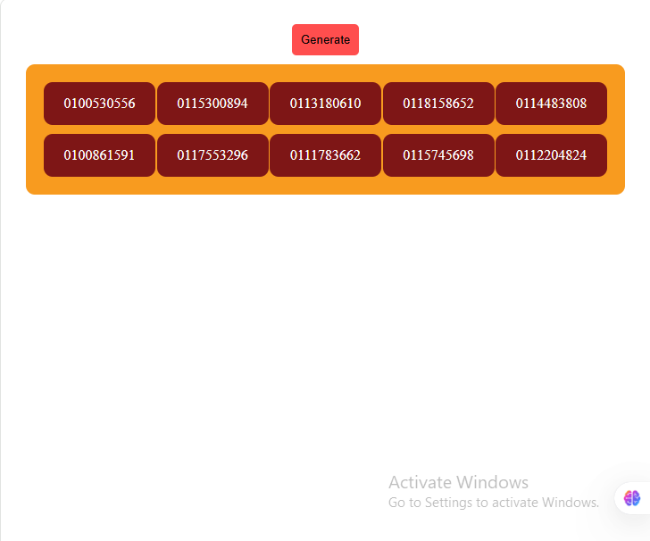

# 📱 Sudani Number Generator

A lightweight JavaScript application that generates valid 10-digit mobile numbers based on the numbering format used by the Sudanese telecom provider **Sudani**.

---

## 🚀 Features

- Generates realistic Sudani mobile numbers
- Follows official numbering conventions (e.g. starts with `092` or `091`)
- Lightweight and fast
- Easy to integrate into other projects or use standalone

---

## 📦 Installation

Clone the repository:

```bash
git clone https://github.com/OmarYasirR/sudani.git
cd sudani-number-generator
